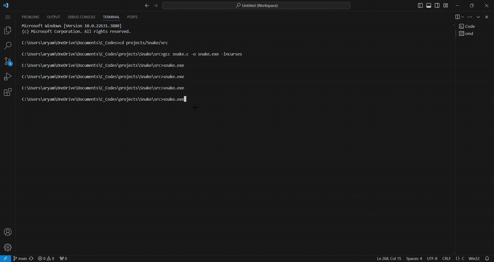

# Snake
This is a snake game that is implemented in C using the ncurses library. You can use the arrow keys to move the snake around, and if the snake touches the wall or itself, the game is over.

# How to compile
```
git clone https://github.com/AryamanNigam/Snake
cd Snake
gcc ./src/Snake.c -o Snake.exe -lncurses
```
## Demo

